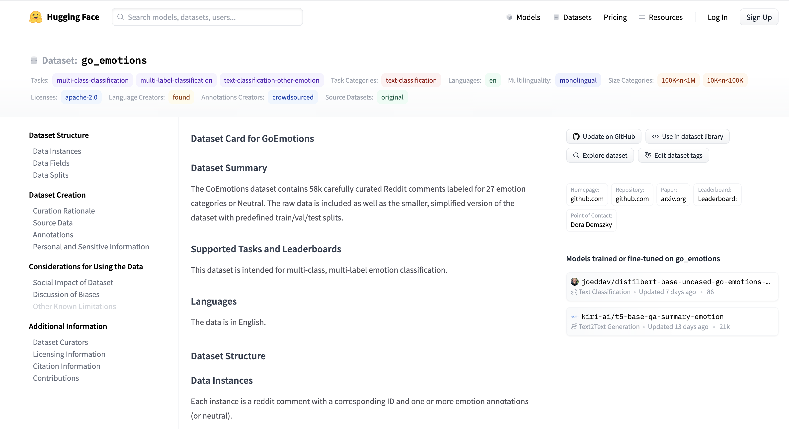

### Training a Multi-Label Emotion Classifier with Tez and PyTorch

If you're tired of rewriting the same boilerplate code of your training pipelines in PyTorch, I've found a pretty neat solution that could make your life easier. Don't worry, it's not a heavy library that'll change your way of doing things.

It's rather a lightweight wrapper that encapsulates your training logic in a single class. It's built on top of PyTorch, it's quite recent but I've tested it and I think it does what it promises so far.

It's called Tez and we'll see it today in action on a fun multi-label text classification problem. Let's jump right in.

### Things that will be covered

- Using the Datasets library to load and manipulate go_emotions data
- Defining the training pipeline with Tez
- Training a SqueezeBert lightweight model for a multi-label classification problem and reaching +0.9 AUC on validation and test data

### Things that will be done next (PR are welcome)

- Deploying the model
- Crafting a small UI with React

### Link to the trained model

[Download it here](https://goemotions-with-tez.s3.eu-west-3.amazonaws.com/model.bin)
